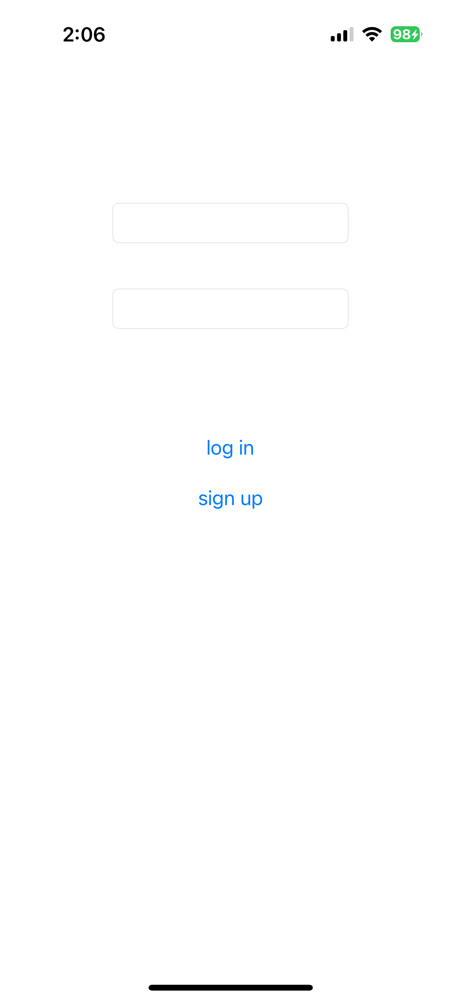
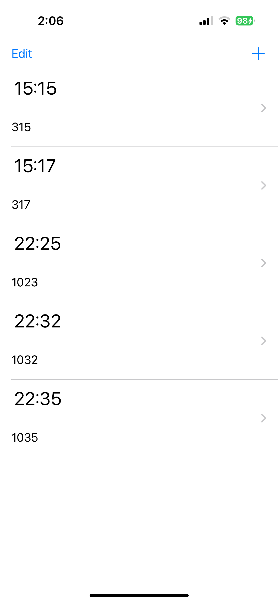
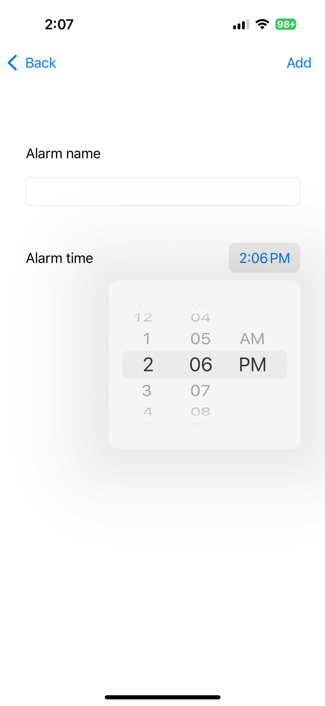

# Alarm

Basic alarm app for me to practise using Swift Package Manager, Firebase and local notifications on iOS. This has a sign up, login mechanism just for fun and practice.

<div>



</div>

<br />

> [!NOTE]
> This app does not need a login screen or workflow but i did it anyways to practise
> You do need your own firebase database for this

## Features

🚀 You can sign up and login

🚀 Alarms are displayed in a table view

🚀 You can edit alarms

🚀 You can delete alarms

🚀 Supports local notifications

## How to install

1. Clone this project
   
```git clone https://github.com/muhdmirzamz/Alarm.git```

2. Open `Alarm.xcodeproj` it in Xcode and let Xcode load the packages and project

3. Go to your Firebase project and download the `GoogleService-Info.plist`

4. Place the `GoogleService-Info.plist` file in your Alarm folder. The file should be in `Alarm/Alarm/GoogleService-Info.plist` from your root folder

5. You should be able to connect your iPhone and run the project now

6. Make sure your iPhone's wifi is turned on
